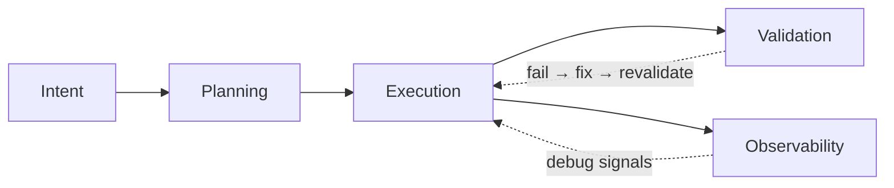

# AGENTS.md — SSO Experimental Project

Single Sign-On demo application with Google and Microsoft OAuth2 support.
Backend: Java 25, Spring Boot 3.5, PostgreSQL, Redis.
Frontend: React 19, TypeScript, Vite 7.

This repo uses a local-first 5-layer harness:



Solid arrows show the common working flow. Observability hangs off execution as supporting runtime/debug context. Dotted arrows show retry and debugging loops back into execution.

## Default contributor flow

1. Read the relevant design spec in `docs/specs/` and active plan in `docs/plans/`.
2. Run `just --list` and prefer `just <recipe>` as the default entry point.
3. Keep the main editor session focused on steering, acceptance criteria, and final synthesis.
4. Use local `copilot` CLI or subagents only for bounded, context-isolated work where only the result matters.
5. Validate with `just check`, then update the active plan’s progress, decision log, validation log, and handoff notes before stopping.

## System of record

- `AGENTS.md` is a concise map, not the encyclopedia.
- Repository-local docs are the source of truth:
      - design specs → `docs/specs/`
      - implementation plans → `docs/plans/`
      - reusable templates → `docs/templates/`
- Keep task-specific guidance in specs and plans rather than bloating this file.
- Prefer progressive disclosure: point agents at the next authoritative document instead of copying large rule sets here.

## Intent and planning

- Use `brainstorming` for new features or modifications.
- Use `multi-agent-brainstorming` for design review before significant changes.
- After intent is clear, create:
      - design spec → `docs/specs/YYYY-MM-DD-<topic>-design.md`
      - implementation plan → `docs/plans/YYYY-MM-DD-<topic>-implementation.md`
- Use templates in `docs/templates/`.

## Execution

Use the `justfile` as the unified task runner:

```bash
just build
just test
just lint
just check
just up
just down
```

Execution conventions:
- Prefix terminal commands with `rtk`.
- Create a git worktree for feature work when isolation matters.
- Use `subagent-driven-development` for parallel independent tasks.
- Use `executing-plans` for sequential dependent tasks.
- Prefer repo-native CLIs and existing tools before adding new MCP/tool surface area.

### Local Copilot CLI

Use local `copilot` CLI for bounded tasks such as repo research, plan critique, architecture review, and second-pass code review.

Default entry points:

```bash
just copilot-prompt <prompt-file>
just copilot-agent <agent-id> <prompt-file>
```

Autonomous entry points (explicit opt-in):

```bash
just copilot-prompt-auto <prompt-file>
just copilot-agent-auto <agent-id> <prompt-file>
```

Guidance:
- Use CLI agents for context isolation, not roleplay job titles.
- Prefer safe/default recipes first; use the `-auto` recipes only when autonomous execution is truly intended.
- Use the CLI default model unless a task explicitly needs a different tier.

## Validation

Run `just check` before claiming completion.

Because `just check` includes Playwright E2E against `http://localhost:8000`, the task runner now fails fast with an explicit `just up` instruction when the local stack is not reachable.

What `just check` currently proves:
- frontend lint
- backend tests
- frontend Playwright E2E

What it does **not** currently prove:
- backend lint/static analysis
- security scanning
- observability/health guarantees

For runtime-facing tasks, start the local stack with `just up` and perform a targeted smoke check. If the stack is down, `just frontend-test` and `just check` will stop early with a readiness message instead of letting Playwright fail later with `ERR_CONNECTION_REFUSED`.

Failure ritual:
- record the failing command
- record the first actionable error
- record the next safe retry step
- record the stop condition if the retry fails again

Never bypass verification with shortcuts like `--no-verify`.

## Observability

When debugging runtime issues:
- backend logs → `docker compose logs backend`
- frontend issues → browser DevTools console
- Playwright failures → traces/screenshots captured by the test tooling

## Pause / resume ritual

When starting or resuming long-running work:
- read the active spec and plan
- review recent git history if the task spans sessions
- read the plan’s handoff notes before making new changes

When stopping:
- update the plan’s `Progress`
- update `Surprises & Discoveries`
- update `Decision Log`
- update `Validation Log`
- leave a short `Handoff / Resume Notes` entry
