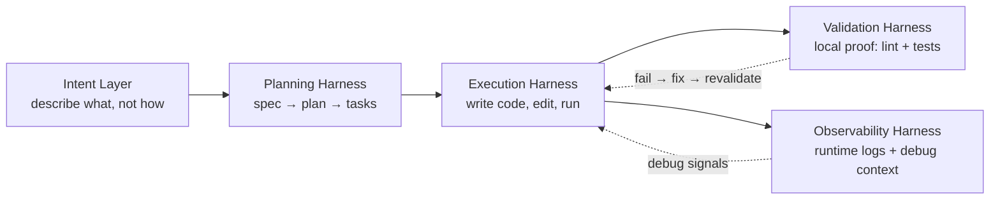
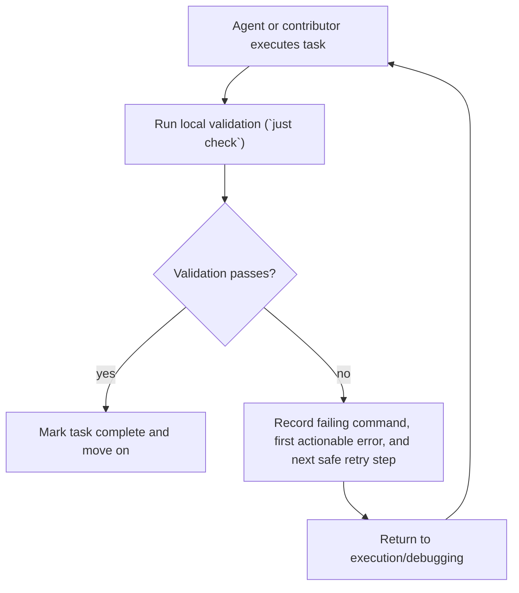

# Harness Engineering Architecture — Design Document

**Date:** 2026-03-15
**Status:** Implemented

## Overview

Define and implement a **5-layer harness architecture** for the sso_experimental project that makes AI agents (and human contributors) more effective at every phase of the development lifecycle — from capturing intent through planning, execution, validation, and observability.

This is **not** about deploying monitoring infrastructure. It is about creating the **artifacts, conventions, and automation entry points** that make agents converge faster, fail less, and produce higher-quality output.

## Goals

- Map every installed skill to a specific harness layer so agents know which skill to invoke at each phase
- Fill critical artifact gaps (task runner, project-level agent config)
- Document when to stay in the main session vs. when to delegate bounded work to local `copilot` CLI agents
- Keep `AGENTS.md` concise and onboarding-first, with deeper state carried by repository-local docs
- Establish conventions that reduce agent context-gathering overhead
- Create a feedback loop where validation failures are routed back into the execution layer

## Non-goals

- Deploying APM/tracing infrastructure (Datadog, Jaeger, etc.)
- Adding new skills to the skill library
- Rewriting existing code — this is process/tooling only
- Building a custom agent framework

## 5-Layer Architecture

Like the overview in `AGENTS.md`, this is the simplified five-layer view of the harness itself: solid arrows show the common working path, observability branches from execution as supporting runtime context, and dotted arrows show retry/debug loops back into execution.

## Layer 1 — Intent Layer

**Purpose:** Capture human intent in a structured form that agents can plan against.

### Current state
- Brainstorming skill exists and works well
- Multi-agent brainstorming available for complex designs

### Gaps
- No design review checklist

### Artifacts to create

None — intent is captured through skills (`brainstorming`, `multi-agent-brainstorming`) and local documentation. GitHub issue templates are out of scope for this local-first demo.

### Skill mapping
- `brainstorming` — explore requirements before design
- `multi-agent-brainstorming` — peer-review simulation for complex designs
- `using-superpowers` — skill discovery and routing

## Layer 2 — Planning Harness

**Purpose:** Transform intent into executable task lists with dependency graphs and acceptance criteria.

### Current state
- Spec docs exist in `docs/specs/` with good structure
- Implementation plans exist in `docs/plans/` with checkbox tasks
- Plans reference skills (subagent-driven-development, TDD, etc.)

### Gaps
- No living-plan sections for progress, decisions, discoveries, validation, and handoff
- Plans not linked to issues/PRs
- No standardized resume ritual for long-running local work

### Artifacts to create

| Artifact | Path | Purpose |
|----------|------|---------|
| Spec template | `docs/templates/spec-template.md` | Standardized design doc structure |
| Plan template | `docs/templates/plan-template.md` | Standardized implementation plan with acceptance criteria |

### Skill mapping
- `writing-plans` — create implementation plans
- `breakdown-epic-pm` — epic to PRD
- `breakdown-epic-arch` — PRD to technical architecture
- `breakdown-feature-prd` — feature PRD from epic
- `breakdown-feature-implementation` — feature implementation plan
- `create-implementation-plan` — plan generation from spec

## Layer 3 — Execution Harness

**Purpose:** Execute tasks with consistent tooling, isolated workspaces, and deterministic build commands.

### Current state
- Docker Compose full-stack orchestration works
- Maven and npm build pipelines work
- Git worktree skill available
- Local `copilot` CLI is available for prompt-driven and agent-driven execution

### Gaps
- No unified task runner (must remember individual commands)
- No AGENTS.md defining agent behavior for this repo
- No documented rule for when to spawn local CLI agents versus staying in the main session
- Top-level guidance can drift if `AGENTS.md` stops being a concise map and duplicates too much detail

### Artifacts to create

| Artifact | Path | Purpose |
|----------|------|---------|
| justfile | `justfile` | Unified task runner: `just test`, `just build`, `just lint`, `just up`, `just down` |
| AGENTS.md | `AGENTS.md` | Project-level agent instructions, harness layer mapping, conventions, and local Copilot CLI delegation rules |

### Skill mapping
- `executing-plans` — sequential plan execution
- `subagent-driven-development` — parallel task orchestration
- `dispatching-parallel-agents` — independent task fan-out
- `using-git-worktrees` — isolated feature branches

### Local-first agent delegation

- Keep the editor session responsible for direction, acceptance criteria, and final synthesis.
- Use local `copilot` CLI agents for focused subtasks where only the end result matters.
- Use local planner/reviewer CLI agents for plan critique, code review, research, and alternative proposals on complex work.
- Use subagents and CLI agents for context isolation, not roleplay specialization.
- Pull CLI agent results back into the main session before making final decisions or applying broad changes.

## Layer 4 — Validation Harness

**Purpose:** Automated quality gates that catch regressions before merge.

### Current state

- Backend: JUnit 5 + Spring Test + MockMvc (good coverage)
- Frontend: Playwright E2E (6 specs, good coverage)
- Frontend: ESLint configured
- Skills: TDD, verification-before-completion, systematic-debugging

### Gaps
- No frontend unit/component tests
- No backend linting (Checkstyle, SpotBugs)
- No security scanning
- No pre-commit hooks

### Artifacts to create

None in this spec — validation runs locally via `just check`. CI/CD pipelines are out of scope for this local-first demo.

`just check` is the default local gate, not a claim of full enterprise coverage. It currently represents the repo's local proof loop for frontend lint, backend tests, and frontend Playwright E2E; scanning and code review remain separate complementary practices.

Because the Playwright portion targets `http://localhost:8000`, the task runner includes a readiness preflight and directs contributors to run `just up` before runtime-dependent validation when the local stack is unavailable.

### Deferred (future implementation work, not this spec)
- Frontend Vitest setup
- Backend Checkstyle/SpotBugs
- OWASP dependency-check
- Pre-commit hooks (Husky + lint-staged)

### Skill mapping
- `test-driven-development` — red-green-refactor
- `verification-before-completion` — evidence before claims
- `systematic-debugging` — root cause investigation
- Local `copilot` CLI reviewer/planner passes complement validation for high-value changes
- `requesting-code-review` — dispatch reviewer
- `receiving-code-review` — handle review feedback

## Layer 5 — Observability Harness

**Purpose:** Give agents (and humans) runtime context for debugging and verification.

### Current state

- Minimal logging (2 explicit debug statements)
- Dependency/container health checks exist for Redis and Postgres in `docker-compose.yml`
- No application health endpoint, metrics, or tracing
- Playwright captures screenshots/traces on failure (good)

### Gaps

- No Spring Boot Actuator
- No structured logging
- No application health endpoint for backend/frontend readiness checks

### Artifacts to create

None in this spec — observability is infrastructure work, not harness documentation. The harness spec acknowledges this as the weakest layer and flags it for a future implementation plan.

### Skill mapping
- `agent-harness-construction` — action space design, observation formatting, error recovery
- `agentic-engineering` — eval-first execution, cost routing, model tiering
- `ai-first-engineering` — team operating model, review focus, testing standards

## Feedback Loop

The critical property of the architecture: **validation failures are routed back into execution through the repo's validation and debugging workflow**.

This loop is a contributor-and-agent ritual, not an automated diagnosis engine. When validation fails, the harness expects the contributor or agent to follow the failure ritual in `AGENTS.md`, use the debugging skills, and re-run validation until the stop condition is met.

That includes readiness failures: when runtime-dependent checks cannot reach the local stack, the harness should fail fast with a clear preflight message and route the contributor back to the correct setup step before retrying validation.

This is enforced by:
1. `verification-before-completion` skill — never claim done without evidence
2. `systematic-debugging` skill — structured root-cause when stuck
3. justfile `check` recipe — single command runs the default local proof loop

## Artifact Summary

| # | Artifact | Layer | Priority |
|---|----------|-------|----------|
| 1 | `AGENTS.md` | L3 Execution | P0 — agents read this first |
| 2 | `justfile` | L3 Execution | P0 — unified task runner |
| 3 | `docs/templates/spec-template.md` | L2 Planning | P2 — standardize specs |
| 4 | `docs/templates/plan-template.md` | L2 Planning | P2 — standardize plans |

## Decision Log

- Decision: Keep the harness local-first and continue deferring CI/CD and issue-template automation.
       - Alternatives considered: restore GitHub-hosted workflow artifacts now; split local and remote harnesses.
       - Objections raised: reviewer concern that the harness looked incomplete without remote automation.
       - Resolution and rationale: rejected for now because the project is explicitly a demo and current scope prioritizes local iteration speed over hosted workflow complexity.

- Decision: Treat `AGENTS.md` as an onboarding map and move living task state into plans.
       - Alternatives considered: keep a larger all-in-one `AGENTS.md`; add a separate top-level handbook.
       - Objections raised: the skeptic and user-advocate reviews found the file overloaded and not onboarding-first.
       - Resolution and rationale: accepted because external references consistently recommend concise top-level agent files plus progressive disclosure.

- Decision: Upgrade implementation plans into living documents with progress, discoveries, validation, decision, and handoff sections.
       - Alternatives considered: keep checkbox-only plans; create a separate handoff file per task.
       - Objections raised: long-running session continuity was weak and plan/spec state drifted.
       - Resolution and rationale: accepted because Anthropic, OpenAI, Muraco, and HumanLayer all emphasize explicit repo-local state for pause/resume continuity.

- Decision: Use local `copilot` CLI primarily for bounded review/research/context-isolated work, with safe defaults first.
       - Alternatives considered: make all CLI recipes autonomous by default; avoid CLI delegation entirely.
       - Objections raised: constraint review flagged broad autonomous permissions and prompt-on-argv handling as unsafe defaults.
       - Resolution and rationale: accepted. Default recipes now use stdin and normal approval flow; explicit autonomous recipes remain available as opt-in tools.

- Decision: Narrow the claim around `just check`.
       - Alternatives considered: keep calling it "full validation"; replace it with several separate default commands.
       - Objections raised: reviewers noted that `just check` was overstated relative to actual coverage.
       - Resolution and rationale: accepted. `just check` remains the golden local command, but docs now describe its real scope and known limits.

- Decision: Sync the harness diagrams around the simplified five-layer flow and treat the feedback loop as workflow guidance rather than automated diagnosis.
       - Alternatives considered: keep the fuller actor-based spec diagram; keep implying that the harness itself emits structured retry guidance.
       - Objections raised: skeptic, constraint-guardian, and user-advocate reviews all flagged semantic drift between `AGENTS.md` and the spec plus overclaiming around validation and observability.
       - Resolution and rationale: accepted. `AGENTS.md` remains the concise canonical map, while the spec now matches its flow semantics and describes the current local-first harness truthfully.

- Decision: Keep `just check` explicit about its runtime prerequisite by failing fast instead of auto-starting the local stack.
       - Alternatives considered: docs-only clarification; automatically call `just up` from validation recipes.
       - Objections raised: the follow-up multi-agent review found that `ERR_CONNECTION_REFUSED` hid the true prerequisite and that auto-starting infrastructure from validation would be too implicit and stateful.
       - Resolution and rationale: accepted. A readiness preflight keeps the validation contract honest, gives contributors a direct recovery step, and avoids making `just check` mutate runtime state.

## Implementation approach

Create all P0 artifacts in a single pass. P2 templates are simple markdown files. No code changes to backend or frontend — this is pure process/tooling. GitHub-hosted features (CI, issue templates) are deferred until the project moves beyond demo scope.
